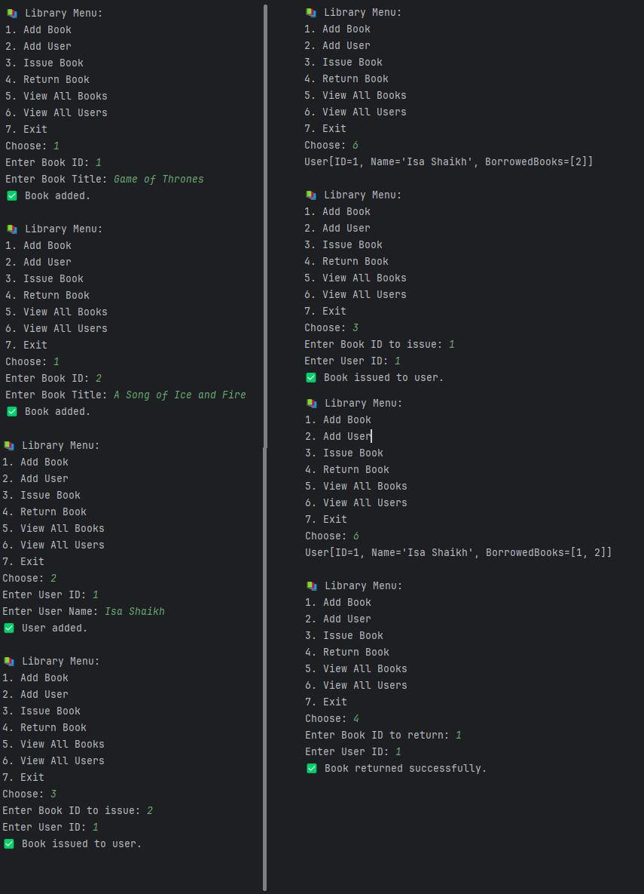

# 📚 Library Management System


Welcome to the **Library Management System** – a console-based Java application that lets you add users, manage books, and perform issue/return operations. Designed with clean OOP principles, this project showcases **abstraction, inheritance, encapsulation, polymorphism**, and **scalable code architecture**.


---


## ✨ Features


✅ Add new books and users  

✅ Issue books to users  

✅ Return issued books  

✅ View all books with status  

✅ View all registered users  

✅ Optimized with **HashMaps** for fast lookups  

✅ Modular code with **model**, **service\**, and **main** separation  

✅ Follows real-world **OOP best practices**


---


## 🎯 Technologies Used


- 💻 Java 17

- 🚀 IntelliJ IDEA (or any Java IDE)

- 🧠 Core Java (No frameworks or databases)

- 🧪 Command Line Interface (CLI)


---


## 🗂️ Project Structure


```
Library-Management-System/
├── README.md
├── .gitignore
└── src/
    ├── Main.java
    ├── model/
    │   ├── Book.java
    │   └── User.java
    └── service/
        └── Library.java
```


---


## 🚀 How to Run


1. **Clone the Repository**

  ```bash

  git clone https://github.com/IsaShaikh/Library-Management-System.git

 cd Library-Management-System

```

2. **Run on IntelliJ**

```bash

Open the Project on IntelliJ and run Main.java

```


---


## 📸 Sample Console Interaction


```

📚 Library Menu:

1. Add Book

2. Add User

3. Issue Book

4. Return Book

5. View All Books

6. View All Users

7. Exit

Choose: 1

Enter Book ID: 101

Enter Book Title: Clean Code

✅ Book added.

```


### 🗄️ Screenshot:




---

## 🔍 OOP Concepts Demonstrated

| Concept         | Where It's Used                                       |
|-----------------|--------------------------------------------------------|
| Encapsulation   | Private fields with getters/setters in `Book`, `User` |
| Inheritance     | Can be extended for `Librarian`, `Admin`, etc.        |
| Abstraction     | `Library` exposes only relevant methods to main       |
| Polymorphism    | Future enhancements can override behaviors            |
| Composition     | Library **has-a** Book and **has-a** User             |

---


## 💡 Future Enhancements


- 📂 Save data to files or a database

- 🌐 Add a GUI interface with JavaFX/Swing

- 🔒 Add authentication \& roles (Librarian, Admin)

- 📊 Track borrow history and due dates


---


## 👤 Author


**Isa Shaikh**  

Java Developer Intern | Clean Code Enthusiast  

[GitHub Profile](https://github.com/IsaShaikh)


---


## 🪪 License


This project is licensed under the [MIT License](LICENSE).


---


## 🤝 Contributing


Feel free to fork the repo, improve the structure, or add features. Contributions are welcome!

